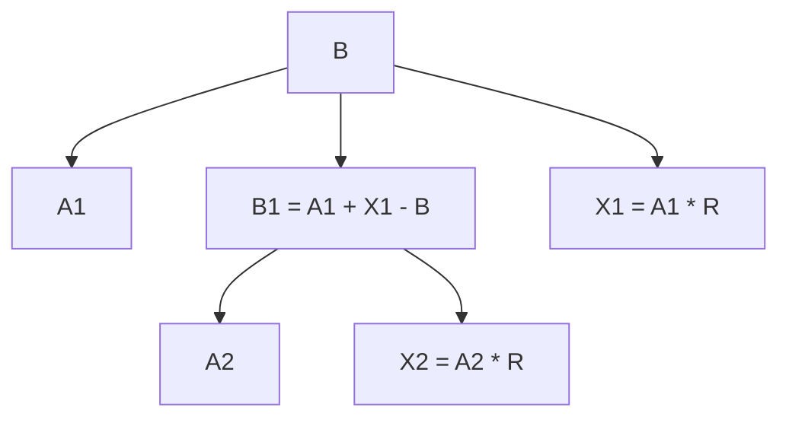
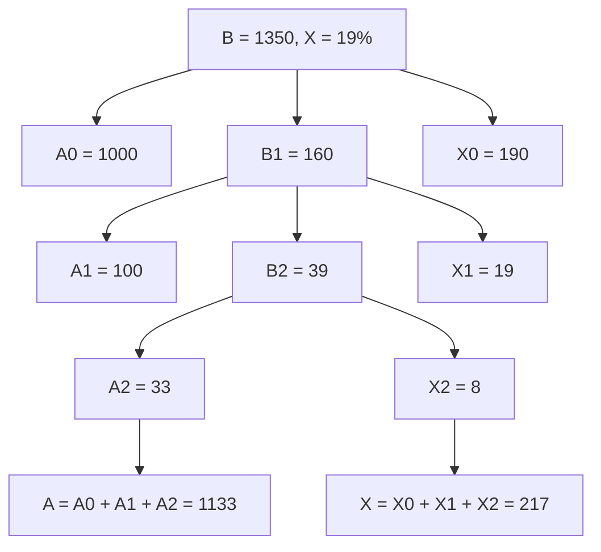

# 加减乘除

## 加法技巧

### 1. 尾数法

**方法概述**:  
尾数法主要用来简化加法的计算。它的思路是从每个数的尾数开始计算，只保留尾数相同的几位进行加法运算，这样可以避免不必要的复杂计算。

**步骤**:

- 选择有几位不同的数位，就只计算那几位的尾数。
- 从最小的数位（个位、十位等）开始计算，并逐位向前借。

**例子**:

**题目**: 6914 + 7111 + 7858 = ?

1. 首先我们从个位开始。求这三个数的个位的和：

   ```
   4 + 1 + 8 = 13，个位是3
   ```

   所以尾数的最后一位是 **3**。

2. 然后我们计算两位尾数（十位）：

   ```
   1 + 1 + 5 = 7
   ```

   这里我们得到的结果是 **83**（13在个位，7在十位）。

3. 如果我们继续加到第三位（百位），我们可以得到更精确的结果，但这里只计算到两位。

4. 最后进行整体计算：

   ```
   6914 + 7111 + 7858 = 21883
   ```

**理解**:
尾数法特别适用于在考试或实际计算中需要快速估算结果的时候，它能让我们省略掉较高位的复杂计算，集中在尾数上。这种方法的关键在于从尾数进行简单的累加，而不必关心高位的变化，特别是在题目要求的是大致结果或简化估算时。

---

### 2. 高位叠加法

**方法概述**:  
高位叠加法是从数值的高位（千位、百位等）开始叠加，逐位往低位计算。这样可以快速得出一个大致的总和。

**步骤**:

- 从最高位开始逐位相加。
- 低位不足两位的数字前面补零，避免计算错误。

**例子**:

**题目**: 6914 + 7111 + 7858 = ?

1. 千位相加：

   ```
   6 + 7 + 7 = 20
   ```

2. 百位相加：

   ```
   9 + 1 + 8 = 18
   ```

3. 十位相加：

   ```
   1 + 1 + 5 = 7，前面补上一个0，变成07
   ```

4. 个位相加：

   ```
   4 + 1 + 8 = 13
   ```

5. 合起来就是：

   ```
   21883
   ```

**理解**:
高位叠加法帮助我们更快速地处理大数的加法运算。通过从最高位开始相加，可以更容易掌握最终结果的数量级，而避免在计算过程中迷失在低位细节中。特别是在遇到多位数时，逐位相加可以降低错误的发生几率。

---

### 3. 削峰填谷法

**方法概述**:  
削峰填谷法通过找出一组数的平均数来简化多个数的加法计算。这个方法的关键是先找一个基准值，接着通过把所有偏离这个基准值的部分相加，再除以总数，得出平均值。

**步骤**:

- 找出一个基准值（通常是最接近的一个数）。
- 计算每个数偏离基准值的部分，进行求和。
- 将求和结果除以总的项数，再加回基准值，得出最终结果。

**例子**:

**题目**: 求平均数 “76 + 72 + 78 + 72 + 77 + 81 + 69 + 75 + 68 + 71”

1. 选取**72**为基准值，因为72接近这些数的中心。

2. 计算每个数偏离72的值：

   ```
   76 - 72 = 4
   72 - 72 = 0
   78 - 72 = 6
   72 - 72 = 0
   77 - 72 = 5
   81 - 72 = 9
   69 - 72 = -3
   75 - 72 = 3
   68 - 72 = -4
   71 - 72 = -1
   ```

3. 求这些偏差的总和：

   ```
   4 + 0 + 6 + 0 + 5 + 9 - 3 + 3 - 4 - 1 = 19
   ```

4. 偏差总和19除以总项数10：

   ```
   19 ÷ 10 = 1.9
   ```

5. 最后，将1.9加回基准值72：

   ```
   72 + 1.9 = 73.9
   ```

**理解**:
削峰填谷法的精髓在于化繁为简，先找出基准值来简化计算，再通过计算偏差来快速得到平均数，可以通过这种方法来避免处理复杂的逐项加法，尤其是在需要计算多个数的平均值时。

---

1. **尾数法**：主要用来快速计算加法的低位，适合于估算和简化加法。
2. **高位叠加法**：逐位加法，能帮助快速掌握大数的总和。
3. **削峰填谷法**：通过计算偏离基准值的偏差，快速求平均数。


## 减法技巧


### 1. 基准值法

**方法概述**:  
基准值法的核心思路是找到一个接近减数的整数作为基准值，把减法问题拆解成两个步骤，分别计算“被减数与基准值的差”和“基准值与减数的差”，再将两个结果相加。

**步骤**:

- 选择一个接近减数的基准值（通常是最接近的整十、整百或整千的数）。
- 将被减数减去基准值，再将基准值减去减数。
- 将两个部分的结果相加，得到最终结果。

**例子**:

**题目**: 764 − 598 = ?

1. 首先，选择一个接近598的整数作为基准值，这里选择600。

2. 计算764减去基准值600：

   ```
   764 − 600 = 164
   ```

3. 然后计算600减去598：

   ```
   600 − 598 = 2
   ```

4. 将两部分结果相加：

   ```
   164 + 2 = 166
   ```

**理解**:
基准值法非常适合处理那些与整十、整百或整千数字接近的减法题目，因为它可以将复杂的减法简化为两个简单的计算步骤。通过分解问题，可以更好地理解减法的结构，并避免因复杂的数字计算而出错。

---

### 2. 分段法

**方法概述**:  
分段法是通过将数字分解为更小的个位和十位来分别进行减法计算，这种方法特别适用于两位数减法的心算。可以通过这种方法快速进行计算，而不需要一步到位。

**步骤**:

- 将被减数和减数的十位和个位分别相减。
- 先从十位数开始，确保得到的是一个可以减的数；如果不够减，则从前面的高位借位。
- 最后进行个位数的计算。

**例子**:

**题目**: 64 − 39 = ?

1. 首先从十位数开始计算：

   ```
   60 − 30 = 30
   ```

2. 接着计算个位数的差值：

   ```
   4 − 9，4不够减9，所以向前借1，变成14 − 9 = 5
   ```

3. 把两部分相加：

   ```
   30 − 10（借位） = 20，最后20 + 5 = 25
   ```

**理解**:
分段法通过将减法拆解成更小的数位计算，有效减少了在心算过程中发生错误的可能性。可以更清晰地理解每一步的计算，而不是将整个数放在一起进行复杂的减法。

---

### 3. 划线减法

**方法概述**:  
划线减法适用于更复杂的数字，特别是当位数不够时，需要进行借位计算。这个方法通过逐步“划线”计算各个位数，从高位到低位逐步进行。

**步骤**:

- 从高位开始逐位进行减法，如果高位不够减，则向前借位。
- 通过逐步划线的方法将每一位的计算结果记录下来，最后将所有部分结果组合在一起得到最终答案。

**例子**:

**题目**: 72 − 53 = ?

1. 先从十位数开始计算：

   ```
   7 − 5 = 2
   ```

2. 然后计算个位数：

   ```
   2 − 3，2不够减3，所以从十位借1，变成12 − 3 = 9
   ```

3. 最后的结果是：

   ```
   19
   ```

**理解**:
划线减法通过逐位的详细计算，帮助更好地理解借位的概念，并逐步记录各个位数的计算过程。特别是在处理借位的场景下，这种方法能有效避免混淆，让掌握借位减法的细节。

---

### 深度理解与应用场景

1. **基准值法**:
   - 适用场景：当被减数与减数接近整十、整百、整千等整数时，这种方法非常有效。
   - 优势：将复杂的减法拆分成简单的整数运算，避免了繁琐的计算步骤。

2. **分段法**:
   - 适用场景：主要用于两位数减法的心算，尤其是当需要快速计算时。
   - 优势：通过分离十位和个位的计算，简化了过程，使更容易在心中计算。

3. **划线减法**:
   - 适用场景：适合多位数、复杂借位减法的计算，特别是在需要逐步解决每个位数时。
   - 优势：逐步计算和划线记录让能够清楚地追踪每一步的减法过程，减少因借位而出错的可能性。

---


## 乘法技巧

### 截位相乘法

**方法概述**:  
截2位，观察第3位

- **第3位≤2**，全舍
- **第3位≥8**，全进
- **第3位**介于2到8之间，**四舍五入**

**例子**:

1. **271.3 × 4625 ≈ 270 × 4600**
2. **278.3 × 4695 ≈ 280 × 4700**
3. **276.3 × 4675 ≈ 270 × 4700**

---

### 小分互换

百分数与分母可互换位置

- **例子**: 

  $$
  \frac{1}{13} ≈ 7.7 \% \iff \frac{1}{7.7} \approx 13 \%
  $$


| 百分数 | 分数 | 百分数 | 分数 |
| ------ | ---- | ------ | ---- |
| 50%    | 1/2  | 33.3%  | 1/3  |
| 25%    | 1/4  | 20%    | 1/5  |
| 16.7%  | 1/6  | 14.3%  | 1/7  |
| 12.5%  | 1/8  | 11.1%  | 1/9  |
| 9.1%   | 1/11 | 8.3%   | 1/12 |

---

### 乘法拆分

**方法概述**:  
把乘数拆成常见的百分数相乘，再相加

**例子**:  
592 × 97 ≈ 592 × (100% − 3%) = 592 − 17.76 ≈ 592 − 18 = 574

---

### 详细理解

1. **截位相乘法**:
   - **适用场景**: 适合快速估算乘法结果，尤其是两位数或多位数相乘的情况下。
   - **步骤**: 根据第三位数的大小，判断是否舍入或进位，然后进行简化后的乘法运算。

2. **小分互换**:
   - **适用场景**: 适合在涉及百分数和分数的运算中快速互换数据，方便心算和估算。
   - **关键点**: 记住常见百分数和分数的对应关系，帮助在题目中快速得出结果。

3. **乘法拆分**:
   - **适用场景**: 适合两位数乘法，通过百分数的拆分来简化运算。
   - **步骤**: 将乘数拆解为整百分数和小百分数的相加形式，进行逐步运算。


## 除法技巧

### 1. 截位直除法

#### 1.1 一步除法

**方法概述**:  
一步除法是指整个算式中只有一个除法运算，我们通过对分母进行截位，简化除法计算。

**步骤**:

- 将分母进行截位（保留几位），再进行简单的除法运算。
- 根据题目要求来确定需要的精度。

**例子**:

**题目**: 564 ÷ 188 = ?

1. 先将188四舍五入到200，简化计算：

   ```
   564 ÷ 188 ≈ 564 ÷ 200 = 2.82
   ```

2. 实际计算结果为3.0。通过截位简化，得到了接近的结果。

**理解**:
在一步除法中，截位直除法通过简化分母的数值，能够帮助我们快速估算出除法结果，适用于题目只要求近似值的情况。

---

#### 1.2 多步除法

**方法概述**:  
多步除法是指在算式中既有乘法又有除法。我们通过同时截分子和分母，使得整个运算变得简单。

**步骤**:

- 同时对分子和分母进行截位。
- 截位后再进行乘除法计算。

**例子**:

**题目**: (1234 × 876) ÷ 498 ≈ ?

1. 先将分子1234四舍五入到1200，分母498四舍五入到500，进行简化：

   ```
   (1200 × 876) ÷ 500 = 1051200 ÷ 500 = 2102.4
   ```

2. 实际计算结果为2169。通过截位得到的结果非常接近实际值。

**理解**:
多步除法适用于那些乘除混合的运算，通过同时截位分子和分母，可以减少计算量，使运算过程更加高效。

---

### 2. 选项差距法

**方法概述**:  
选项差距法是一种在选择题中常用的估算方法，目的是通过观察选项之间的差距，快速排除不合适的选项，找到最接近的答案。

**步骤**:

- 当四个选项差距较大时，只需观察最接近的两个选项。
- 如果选项差距小，通过进一步的计算得出准确的答案。

#### 2.1 截3位 - 选项差距【小】

**适用场景**:  
当选项之间差距较小时，可以通过简单的截位来快速估算出最接近的答案。

**例子**:

**题目**: 358 ÷ 7 = ?

选项:  
A. 51  
B. 52  
C. 53  
D. 54

1. 先截取前三位进行除法运算：

   ```
   358 ÷ 7 ≈ 51.14
   ```

2. 通过估算得出答案接近**51**。

**理解**:
当选项差距较小时，可以通过估算或者截位，快速选择出最接近的答案。这种方法能够减少逐位计算的负担，适合快速判断答案的场景。

#### 2.2 截2位 - 选项差距【大】

**适用场景**:  
当选项之间差距较大时，我们可以通过观察首位数字来快速判断答案。

**例子**:

**题目**: 1542 ÷ 31 = ?

选项:  
A. 40  
B. 50  
C. 60  
D. 70

1. 截取前两位进行估算：

   ```
   1500 ÷ 30 = 50
   ```

2. 因为实际计算结果为49.74，选择最接近的选项**B. 50**。

**理解**:
当选项差距较大时，可以通过估算前两位数字，快速判断出答案，节省计算时间。

---

### 3. 除法拆分

**方法概述**:  
除法拆分是将复杂的除法拆解成简单的部分进行逐步计算，尤其适用于分子和分母有规律变化的情况。

**步骤**:

- 分子与分母的大小相似时，可以使用拆分法将式子逐步化简。
- 将分子和分母按照倍数或比例关系进行比较，从而得出结果。

**例子**:

**题目**: 592 ÷ 97 = ?

1. 先将97近似为100，进行拆分计算：

   ```
   592 ÷ 100 = 5.92
   ```

2. 因为97比100小，我们可以将结果调整：

   ```
   5.92 × (100 ÷ 97) ≈ 6.1
   ```

3. 实际计算结果为6.1。

**理解**:
除法拆分法特别适合进行复杂数值的快速计算，通过近似和拆分，可以让在较短时间内得出接近准确的答案。

---

### 4. 常用分数比较

**方法概述**:  
分数比较法是通过对分子和分母的比较，快速判断分数大小的一种方法。可以利用常见的分数和百分比关系来进行估算。

**例子**:

**题目**: 比较1/7和1/8的大小。

1. 利用分母比较法：分母越大，分数值越小。

   ```
   因为7 < 8，所以1/7 > 1/8
   ```

2. 利用百分比：1/7 ≈ 14.3%，1/8 ≈ 12.5%。因此1/7的值较大。

**理解**:
通过常见分数和百分比的对应关系，可以快速进行分数比较。这种方法适用于简化复杂的分数问题，也能帮助在心算中进行判断。

---


## 增量估计法

增量估计法 是一种用于快速估算和计算增长率的数学技巧。它的核心在于通过将增长率化成近似的分数，并运用这些分数来求解基期和变化量，从而实现快速计算的目标。

### 基本步骤

1. **将增长率化为相近的分数**  
   比如，假设有一个增长率是 $$ 25 \% $$，我们可以近似为分数 $$ \frac{1}{4} $$。

2. **找到基期和变化量**  
   假设基期量为 $$ A  = 4 $$，那么根据增长率化成的分数，变化量就是 $$ X = 1 $$ 份，现期量是 $$ B = A + X = 4 + 1 = 5 $$ 。

3. **根据一份量大小和变化量求解基期**  
   根据我们分解的分数，接着继续求解份数来确定变化量，从而求得基期的值。

### 基期使用的公式

当我们得到了一个增长率的近似分数后，使用以下公式来求解基期：

$$ A = B - X $$   

其中，A 为基期，B 为本期量，X 为变化量。

变化量的大小通过分数的估算来求得，分数越精确，误差就越小。

### 详细例子

**例子1：**  
假设现期 $B = 328$，增长率 $R = 49.8\%$。

1. **将增长率化为分数：**  
   $49.8\%$ 可以近似为分数 $\frac{1}{2}$。

2. **分配份数：**  
   根据 $\frac{1}{2}$ 的分数关系，可以得出基期 $A = 2$ 份，变化量 $X = 1$ 份，总份数为 $3$ 份。

3. **求解变化量：**  
   变化量 $X$ 为 $B$ 除以总份数的结果再乘以变化量的份数，即：

   $$ X = \frac{328}{3} \times 1 \approx 109 $$

4. **求解基期：**  
   根据公式 $A = B - X$：

   $$
   A = 328 - 109 = 219
   $$

   所以，基期 $A = 219$。

**例子2：**  
假设现期 $B = 694$，增长率 $R = -33.4\%$。

1. **将增长率化为分数：**  
   $-33.4\%$ 可以近似为分数 $-\frac{1}{3}$。

2. **分配份数：**  
   根据 $-\frac{1}{3}$ 的分数关系，基期 $A = 3$ 份，变化 $X = -1$ 份，基期为 $B = A + X = 3 + (- 1) = 2$ 份。

3. **求解变化量：**  
   变化量 $X$ 为 $B$ 除以现期份数的结果再乘以变化量的份数，并且是负值：

   $$ X = \frac{694}{2} \times (-1) = -347 $$

4. **求解基期：**  
   根据公式 $$ A = B - X $$，由于变化量是负的，所以公式为：

   $$ A = 694 + 347 = 1041 $$

   所以，基期 $A = 1041$。

### 理解的关键

1. **理解增长率与分数的转换**：需要掌握如何将一个增长率近似为常见分数，比如 $50\% \approx \frac{1}{2}$，$33\% \approx \frac{1}{3}$ 等。

2. **分数对应的份数**：明白如何根据分数来分解本期量和变化量。比如， $\frac{1}{2}$ 表示本期量有 2 份，变化量有 1 份。

3. **使用公式求解基期**：掌握公式 $A = B - X$ 的使用，并结合估算的结果来求解基期。


## 假设分配法

### 核心思想

和拆分一样，都是“抓大放小”，将“大数”分完，“小数”有误差也不影响结果了。


### 步骤



1. **确定被分配数和增长率**
2. **画出分配树，确定 A 和 X**
3. **最后一步直接根据 $X ≈ BR$，误差可忽略**
4. **最终结果** $A = A_1 + A_2$ &nbsp; $X = X_1 + X_2$

---

### 示例：

- **已知：**  
  $B = 1350$， $R = 19\%$



- **分配步骤：**  
  1. **第一步：**  
     将 $B = 1350$ 分为基期 $A0 = 1000$ 和较小的数 $X0 = 190$，$B1 = 1350 - 1000 - 190 = 160$

  2. **第二步：**  
     将剩下的 $B1 = 160$ 再次分成 $A1 = 100$ 和 $X1 = 19$，$B2 = 160 - 100 - 19 = 41$

  3. **第三步：**  
     将剩下的较小部分 $41$ 进行计算。  
     $$ X2 = 41 \times 20\% ≈ 8 $$  
     $$ A2 = B2 - X2 = 41 - 8 = 33 $$

  4. **相加结果:**
     $$ A = A0 + A1 + A2 = 1000 + 100 + 33 = 1133 $$  
      $$ X = X0 + X1 + X2 = 190 + 19 + 8 = 217 $$

